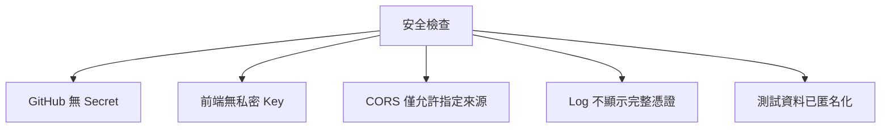
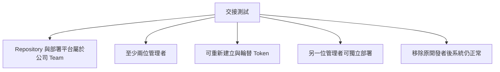
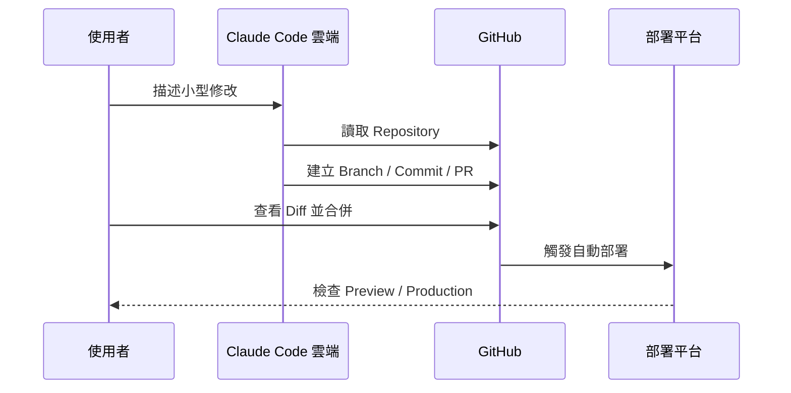

完成部署不等於產品已經完成。最後一篇要確認 Data Machi 在正式環境中真的可用，並建立日後透過本機或雲端 Coding Agent 持續維護的流程。


## 五個層次的驗收

### 1. 功能驗收

- 最小 Gemini 對話正常。
- Sheets 問題與人工核對結果一致。
- PDF RAG 能顯示來源並拒答無資料問題。
- Trello、Confluence、Groq 等選配功能可獨立開關。
- 多輪追問、釐清與要求最新資料的流程正確。

### 2. 失敗驗收

刻意製造以下情況：

- 移除或填錯 Gemini Key。
- 將 Sheet 取消分享。
- 上傳無法解析的 PDF。
- 使用失效 Token。
- 關閉 Render 或改錯 Backend URL。
- 讓模型呼叫超過 Timeout。

每種失敗都應結束 Loading、顯示明確原因，並提供下一步建議。

### 3. 安全驗收



另外檢查：

- `.env`、Service Account JSON 與索引暫存均在 `.gitignore`。
- Vercel 只保存可公開的前端設定。
- Render Secret 依最小權限原則配置。
- 教學截圖、README 與錯誤訊息沒有企業識別資訊。

### 4. 使用體驗驗收

- 桌機與手機都能正常操作。
- Render 冷啟動時有清楚等待狀態。
- 工具執行時顯示真實進度。
- 回答完成、失敗、查核中等狀態不混淆。
- 長回答、文件來源與錯誤訊息在小螢幕仍可閱讀。

### 5. 所有權與交接驗收

這一層確認 Data Machi 不會因為單一開發者離開而停止運作。



請安排另一位管理者實際操作，而不是只閱讀文件：

- 找到公司 GitHub Organization、Render Workspace、Vercel Team 與 Google Cloud Project。
- 依照文件重新部署前端與後端。
- 找到 Secret 名稱與存放位置，但文件中沒有完整明文憑證。
- 建立一組測試 Token、切換環境變數並撤銷舊 Token。
- 確認 Trello、Confluence 與 Sheets 整合帳號只具必要權限。
- 模擬移除主要開發者帳號後，服務仍可維護與運作。

若以上任一步驟只能由原開發者完成，代表交接仍未完成，應回到〈實作 17｜權限與資訊安全〉補齊資產清冊、備援管理者與輪替流程。

## 遠端 Vibe Coding 維護流程

當你不在主要電腦旁，可以透過 Claude Code 桌面或手機端啟動雲端開發：



適合遠端處理的項目包括 Prompt 文案、錯誤訊息、README、環境變數範例與小型 UI 修正。大型架構、PDF／音訊處理、跨服務除錯則較適合回到本機完整測試。

## 如何安全回復版本？

- 小型錯誤：建立修正 Commit。
- 尚未合併的 PR：關閉 PR 或修正 Branch。
- 已合併且部署失敗：Revert 對應 Commit。
- 部署平台問題：先查看 Log，避免在不確定原因時連續亂改。

不要只依賴平台的重新部署按鈕；GitHub 中的程式版本才應該是正式來源。

## 最終完成清單

- [ ] 有自己的去識別化 Repository
- [ ] Gemini、Sheets 與 PDF RAG 正常
- [ ] Render 後端與 Vercel 前端已串接
- [ ] CORS、Environment Variables 與 Secret 正確
- [ ] 多輪記憶與可靠性測試完成
- [ ] GitHub PR、部署與版本回復流程可操作
- [ ] Repository、Render、Vercel 與 Cloud Project 不綁定單一個人帳號
- [ ] 至少有一位備援管理者可重新部署與輪替 Token
- [ ] 資產與憑證清冊已建立，且不包含完整明文 Secret
- [ ] 移除主要開發者權限後，系統仍可正常運作
- [ ] 可從桌機與手機完成正式環境驗收

## 建議的 Vibe Coding Prompt

```text
請根據目前 Repository、Render 與 Vercel 設定，建立正式上線驗收計畫。
必須包含：核心功能、外部服務失敗、安全、CORS、跨裝置、冷啟動、部署回復與 Secret 掃描。
不要直接修改程式，先列出測試步驟、預期結果與失敗判斷方式。
```

## 建議補充的操作截圖

> 📸 **操作截圖建議｜正式驗收紀錄表** 使用表格或 Issue 範例呈現測試項目、預期結果、實際結果、負責人與日期，並附上一個通過與一個失敗案例。

> 📸 **操作截圖建議｜跨裝置驗收** 並排顯示桌機與手機操作 Data Machi 的畫面，確認輸入框、進度狀態、來源引用與錯誤訊息在小螢幕仍可閱讀。

> 📸 **操作截圖建議｜Pull Request 到自動部署** 以連續畫面呈現 PR 合併、GitHub deployment check、Render／Vercel 部署完成與正式環境驗收。

> 📸 **操作截圖建議｜Revert Commit** 截取 GitHub 對已合併 Commit 執行 Revert、建立回復 PR，以及部署平台重新部署成功的流程。

> 📸 **操作截圖建議｜備援管理者交接測試** 使用匿名帳號示範第二位管理者可以找到 Repository、部署平台、Secret 名稱與重新部署入口，作為不綁定單一個人的驗收證據。

<Info>
  完成這 21 篇後，你不只是複製一個聊天介面，而是理解如何用 GitHub、Vibe Coding、外部 API、LangGraph、權限治理、Render 與 Vercel，建立、交接並持續維護一套屬於自己的 Data Machi。
</Info>