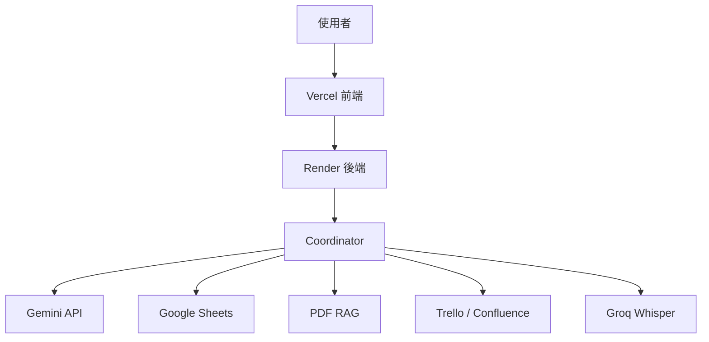

前 15 天，我們花時間理解一件事：**企業 AI 的困難從來不只是在模型本身，而是在資料、工具、流程、狀態與可靠性如何一起工作。**

從 Day 16 開始，我們把這些觀念真的做出來。

實作篇不會把重點放在背 Python 語法，也不要求你先成為全端工程師。這裡採用 **Vibe Coding** 的方式：你可以在本機使用 VS Code 搭配 Claude Code、Codex 或其他 AI Coding Agent，也可以透過雲端 Coding Agent 修改 GitHub Repository。真正重要的是，你要逐步知道自己正在改哪一層、每個 API Key 應該放在哪裡，以及完成一個步驟後要如何確認它真的成功。

## 實作篇不是照服務拆，而是照「做產品的順序」拆

原本的內容已經涵蓋 GitHub、Gemini、Google Service Account、Atlassian、Groq、RAG、Coordinator、Memory、Reliability、Security、Render 與 Vercel。這次重新編排，不再讓每個服務各自成為一條孤立路線，而是把它們整理成 15 個可以逐日完成的實作單元。

換句話說，讀者每天應該都能回答一個很具體的問題：**今天完成後，我的 Data Machi 比昨天多了什麼能力？**

---

## Day 16–20｜先把環境與外部服務準備好

### Day 16｜看懂 Data Machi 的服務地圖與開發方式

先不要急著申請 API。第一天先看懂 GitHub、AI Coding Agent、Vercel、Render、Gemini 與各種資料來源之間的關係，並選擇自己要使用本機、雲端或混合式 Vibe Coding。

這一天完成後，你應該能畫出整套產品架構，也知道「開發工具」和「正式產品服務」不是同一件事。

### Day 17｜建立 GitHub 中心與 Secret 管理方式

GitHub 會是整個專案的正式版本來源。這一天除了理解 Repository、Commit、Branch 與 Pull Request，也會一起整理 `.env`、Render Environment、Vercel Environment，以及哪些設定可以公開、哪些絕對不能進 Git。

把版本與 Secret 放在同一天，是因為這兩件事其實都在回答同一個問題：**這個專案未來要如何被安全地維護？**

### Day 18｜申請 Gemini API，完成模型連線

這一天讓 Data Machi 第一次真正接上語言模型。除了取得 API Key，也會理解模型選擇、額度、環境變數，以及本機和正式環境應如何使用不同設定。

完成條件不是「我拿到 Key 了」，而是能成功發出一次請求並收到模型回應。

### Day 19｜建立 Google Service Account

Google Sheets 不應該依賴某一位使用者手動登入。這一天會建立 Service Account、啟用必要 API、分享測試試算表，並把憑證安全放入本機與 Render。

這一步的核心，是讓後端可以用機器身份穩定讀取資料，而不是把個人帳號綁進產品。

### Day 20｜準備 Atlassian 與 Groq 等選配服務

如果你希望 Data Machi 能讀取 Confluence、查 Trello 專案狀態，或把會議錄音轉成文字，這一天會準備相對應的 API 與權限。

這些服務不是所有人都必須使用，因此會清楚標示為選配。重點不是「全部都申請」，而是知道自己的使用情境需要哪些資料來源。

---

## Day 21–25｜從最小產品走到真正的知識工作流

### Day 21｜建立自己的專案副本並在本機啟動

從開源版本建立自己的 Repository，完成去識別化與環境設定，接著啟動 React 前端與 FastAPI 後端。

這一天不追求功能完整，只要先確認兩個服務都能正常啟動，並理解前端如何透過 API 呼叫後端。

### Day 22｜完成最小 AI 對話

先不要一次把 Sheets、RAG、Trello 全部加進來。只保留最小路徑：**Frontend → Backend → Gemini → Response**。

這樣做的原因很簡單。如果最基本的模型主幹都還沒有確認，後面任何工具錯誤都會變得很難排查。

### Day 23｜加入 Google Sheets Tool

這一天加入第一個可驗證的資料工具。Data Machi 會讀取匿名測試資料，透過欄位別名、Pandas 或後端邏輯做篩選與計算，再把結果交給模型整理。

重點是讓**程式負責精確數字，模型負責理解意圖與組織答案**，而不是把整張試算表丟進 Prompt 後期待模型自己算對。

### Day 24｜加入 PDF RAG

準備匿名 PDF、建立索引、切割文件內容，並驗證搜尋結果是否真的來自正確文件。

這一天會把前面 RAG 觀念篇講過的 Parse、Chunk、Embedding、Search 變成真正可執行的文件工具，也會確認回答是否能保留來源。

### Day 25｜建立 Coordinator

當 Data Machi 同時有 Gemini、Sheets 與 RAG 之後，下一個問題就是：**使用者為什麼要自己決定查哪個工具？**

Coordinator 的工作，就是根據問題判斷要查哪一個來源、是否需要跨來源查詢，以及最後如何把不同工具的結果整合成一個回答。這一步完成後，系統才真正從「多個工具」走向「一條工作流」。

---

## Day 26–30｜把 Demo 變成可以交付的產品

### Day 26｜加入 Memory、Clarification 與 Verification

真實使用者不會每次都重新講完整問題。他們會說「那上個月呢？」、「剛剛那個專案現在誰負責？」。因此系統需要保留近期對話與工具結果，也要知道什麼資訊可以沿用、什麼情況必須重新查詢。

同時，當問題不夠清楚時，系統應該先釐清，而不是猜一個看似合理的答案。

### Day 27｜加入 Reliability 與 Security

模型會逾時、API 會限流、外部服務可能暫時不可用，憑證也可能被誤放在程式碼中。這一天會把 Timeout、Retry、Fallback、錯誤訊息、最小權限、Token 管理與資產所有權一起整理。

因為到了這一步，我們已經不再是在做 Demo，而是在思考一個產品如何長期運作。

### Day 28｜把 FastAPI 後端部署到 Render

連接 GitHub Repository，設定 Root Directory、Build Command、Start Command、Environment Variables 與健康檢查，讓後端離開本機後仍能穩定運作。

這一天的完成條件，是你可以從外部 URL 正常呼叫後端 API。

### Day 29｜把 React 前端部署到 Vercel，完成正式串接

部署前端後，會設定 Backend URL、CORS allowlist，以及 Preview 與 Production 的環境差異。

前端能打開不代表部署完成。真正完成的條件，是瀏覽器上的正式網站可以成功呼叫 Render 後端，並取得 Gemini、Sheets 或 RAG 的真實結果。

### Day 30｜正式驗收、交接與持續維護

最後一天不再新增功能，而是做完整驗收：功能、權限、Secret、跨裝置、部署、版本回復與離職交接都要被確認。

這也是企業產品和個人 Side Project 最大的差異之一：**做得出來只是第一步，別人能不能安全接手、出問題能不能回復，才決定它能不能真的被使用。**

---

## 每一篇實作文章會用同一個結構

後續文章會統一用以下節奏重新整理，避免變成只有操作步驟、卻不知道自己為什麼在做：

1. **今天要完成什麼**：先說明這一步會讓系統增加什麼能力。
2. **它在整體架構中的位置**：把今天的服務放回 Data Machi 產品圖。
3. **開始操作**：依照實際順序完成設定與修改。
4. **如何驗證成功**：提供明確的成功條件，而不是只說「完成設定」。
5. **常見踩坑**：整理憑證、權限、路徑、環境變數與部署最容易出錯的地方。
6. **今天只要記住一件事**：用一個結論收束，再銜接下一天。

<Note>
  實作過程建議優先使用匿名或測試資料。等整條流程都能穩定運作，再逐步替換成正式資料來源與公司環境，會比一開始就直接串正式系統更容易排查問題，也更安全。
</Note>