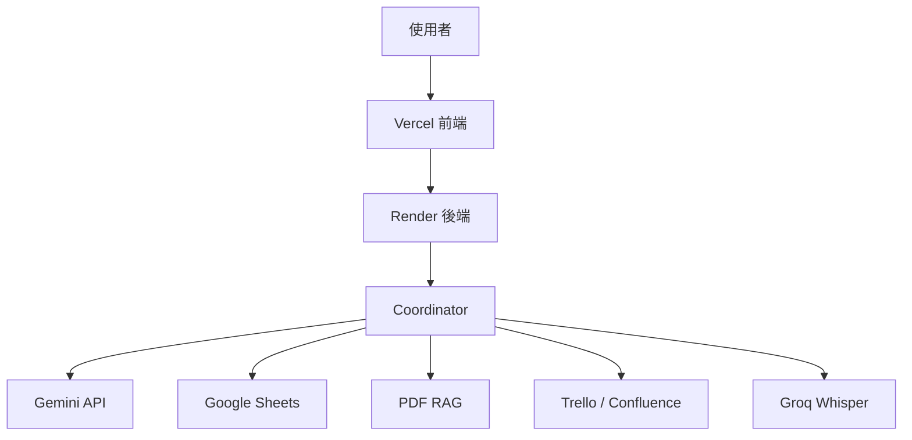

前 15 天，我們花時間理解一件事：**企業 AI 的困難從來不只是在模型本身，而是在資料、工具、流程、狀態與可靠性如何一起工作。**

從 Day 16 開始，我們把這些觀念真的做出來。

實作篇不會把重點放在背 Python 語法，也不要求你先成為全端工程師。這裡採用 **Vibe Coding** 的方式：你可以在本機使用 VS Code 搭配 Claude Code、Codex 或其他 AI Coding Agent，也可以透過雲端 Coding Agent 修改 GitHub Repository。真正重要的是，你要逐步知道自己正在改哪一層、每個 API Key 應該放在哪裡，以及完成一個步驟後要如何確認它真的成功。

## 實作篇不是照服務拆，而是照「做產品的順序」拆

這 21 篇實作單元把 GitHub、Gemini、Google Service Account、Atlassian、Groq、RAG、Coordinator、Memory、Reliability、Security、Render 與 Vercel 整理成可以逐步完成的路徑，而不是讓每個服務各自成為一條孤立路線。

換句話說，讀者每完成一篇都應該能回答一個很具體的問題：**今天完成後，我的 Data Machi 比昨天多了什麼能力？**

---

## 實作 01–08｜先把環境與外部服務準備好

先看懂 GitHub、AI Coding Agent、Vercel、Render、Gemini 與各種資料來源之間的關係，選擇本機、雲端或混合式 Vibe Coding，建立 GitHub 中心與 Secret 管理方式，再依序申請 Gemini API、Google Service Account，以及 Trello、Confluence、Groq 等選配服務。

## 實作 09–16｜從最小產品走到真正的知識工作流

建立自己的專案副本並在本機啟動，先完成最小 AI 對話確認 Gemini 主幹，再依序加入 Google Sheets Tool、PDF RAG，建立 Coordinator 讓系統自己選工具，接著加入 Memory、Clarification 與 Verification，最後補上 Timeout、Retry、Fallback 等可靠性機制。

## 實作 17–21｜把 Demo 變成可以交付的產品

先完成權限與資訊安全盤點，確認系統不綁在單一個人帳號上，再把 FastAPI 後端部署到 Render、React 前端部署到 Vercel，正式串接 CORS 與環境變數，最後完成正式驗收、交接與持續維護。

---

## 每一篇實作文章會用同一個結構

後續文章會統一用以下節奏重新整理，避免變成只有操作步驟、卻不知道自己為什麼在做：

1. **今天要完成什麼**：先說明這一步會讓系統增加什麼能力。
2. **它在整體架構中的位置**：把今天的服務放回 Data Machi 產品圖。
3. **開始操作**：依照實際順序完成設定與修改。
4. **如何驗證成功**：提供明確的成功條件，而不是只說「完成設定」。
5. **常見踩坑**：整理憑證、權限、路徑、環境變數與部署最容易出錯的地方。
6. **今天只要記住一件事**：用一個結論收束，再銜接下一篇。

<Note>
  實作過程建議優先使用匿名或測試資料。等整條流程都能穩定運作，再逐步替換成正式資料來源與公司環境，會比一開始就直接串正式系統更容易排查問題，也更安全。
</Note>