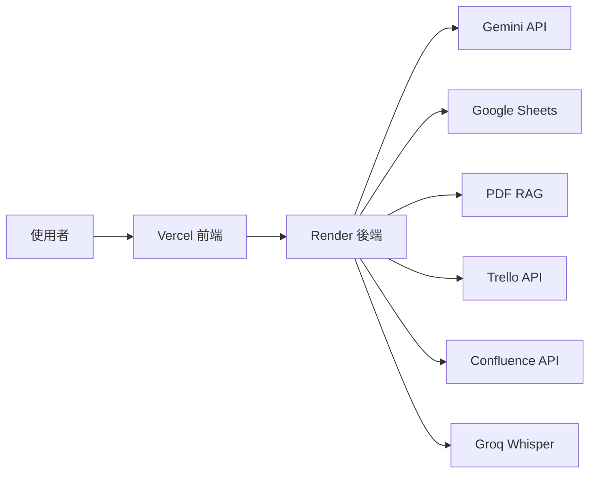
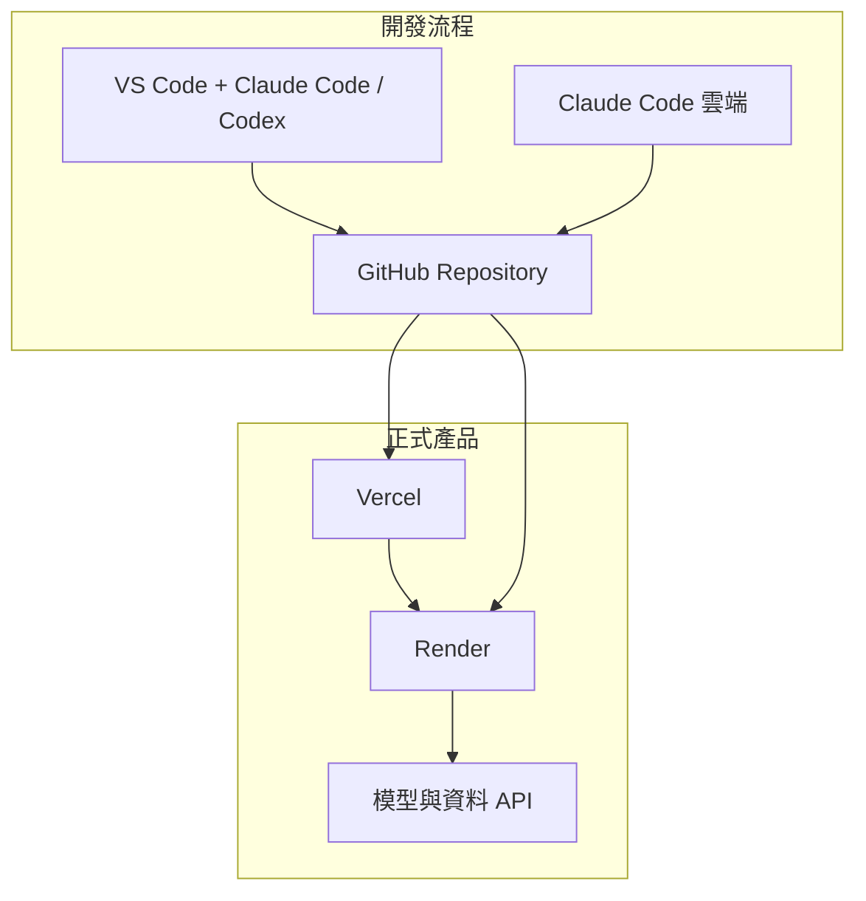

在開始申請 API 或部署服務之前，先不要急著碰設定。第一步是看懂：**Data Machi 不是一個單獨的程式，而是一組彼此合作的服務。**

## 每個服務負責什麼？

| 服務 | 在系統中的角色 | 是否必要 |
| --- | --- | --- |
| GitHub | 保存程式碼、版本與部署來源 | 必要 |
| Vercel | 部署 React 前端 | 必要 |
| Render | 執行 FastAPI 與 LangGraph 後端 | 必要 |
| Gemini API | 理解問題、選擇工具、產生回答 | 必要 |
| Google Sheets | 提供結構化資料 | 建議 |
| PDF RAG | 搜尋文件內容 | 建議 |
| Trello / Confluence | 專案進度與知識庫 | 選配 |
| Groq Whisper | 會議錄音轉文字 | 選配 |

## 產品架構與開發架構不要混在一起

Claude Code 與 Codex 是協助你建造產品的工具；產品上線後並不需要它們持續運作。真正在線上服務使用者的是 Vercel、Render、Gemini 與資料來源。

## 本篇完成後，你應該能回答

- 前端為什麼部署在 Vercel？
- 後端為什麼部署在 Render？
- Gemini API Key 與 Google Service Account 有何不同？
- 哪些服務是核心，哪些可以晩一點再加？
- GitHub 為什麼是整個流程的中心？

<Info>
  今天只要記住一件事：先看懂服務之間的關係，再開始申請帳號與修改程式，會比一邊做一邊猜更有效率。
</Info>

下一篇會介紹本機、雲端與混合式 Vibe Coding 的差異，協助你選擇最適合自己的開發方式。