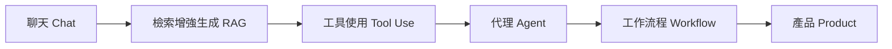

這套 30 天系列只有一條主線：**從一個只能聊天的模型開始，逐步加入企業資料、工具、決策、流程控制與產品化能力，最後完成可以實際部署的 Data Machi。** 觀念與實作會交錯進行，讓每個技術概念都能回到真實工作問題中理解。

每五天是一個階段。每個階段都先回答「為什麼需要這個能力」，再把它放進同一套系統裡。這樣不需要先讀完大量理論才開始動手，也不會完成一堆 API 設定後，仍不知道它們在整體架構中的位置。

## 第一階段｜Day 01–05：從聊天到企業 AI

先從企業知識工作的問題開始，而不是從框架開始。這五天會釐清聊天機器人與企業 AI 的差異、FUDAT 知識工作框架、模型的企業知識邊界，以及為什麼提示詞（Prompt）無法取代工作流程（Workflow）。Day 05 會把這些觀念收斂成 Data Machi 的完整產品地圖。

| Day | 主題 |
| --- | --- |
| 01 | 企業 AI 不是聊天機器人 |
| 02 | 知識工作的五個步驟：FUDAT |
| 03 | 為什麼 AI 不知道你公司的事？ |
| 04 | 提示詞與工作流程 |
| 05 | Data Machi 全貌 |

## 第二階段｜Day 06–10：讓 AI 找到企業知識

第二階段集中處理檢索增強生成（RAG）。從基本概念開始，接著理解 PDF 如何經過解析（Parse）、文件切割（Chunking）、向量化（Embedding）與建立索引（Index），並比較關鍵字搜尋與語意搜尋。Day 09 會處理掃描 PDF、表格與圖片等真實文件問題，Day 10 則完成第一個能引用來源的 PDF RAG。

| Day | 主題 |
| --- | --- |
| 06 | 什麼是檢索增強生成（RAG）？ |
| 07 | PDF 如何變成可搜尋知識？ |
| 08 | 關鍵字搜尋與語意搜尋 |
| 09 | 掃描 PDF、表格與圖片 |
| 10 | 實作：建立第一個 PDF RAG |

## 第三階段｜Day 11–15：從文件檢索走向工具使用

RAG 可以查文件，但無法自然處理最新數字與外部系統狀態。這五天會從 RAG 的能力邊界進入工具使用（Tool Use），理解 LangChain 在工具整合中的角色，再實際建立 Google Sheets 資料工具。最後畫出企業知識地圖，並完成一次試算表與文件的跨來源查詢。

| Day | 主題 |
| --- | --- |
| 11 | RAG 找到文件，為什麼還不夠？ |
| 12 | 工具使用與 LangChain |
| 13 | 實作：Google Sheets 資料工具 |
| 14 | 企業知識地圖 |
| 15 | 實作：跨來源查詢 |

## 第四階段｜Day 16–20：從工具走向代理

當工具變多，就不可能永遠靠固定條件判斷。這一段會說明什麼時候工具使用才真正變成代理（Agent），再用推理與行動（ReAct）理解「判斷 → 行動 → 觀察」的循環，並釐清路由器（Router）與協調者（Coordinator）的差異。Day 19 會建立 Data Machi 協調者，Day 20 再加入多來源、平行與順序執行的設計。

| Day | 主題 |
| --- | --- |
| 16 | 工具使用什麼時候變成代理？ |
| 17 | ReAct 決策循環 |
| 18 | 路由器與協調者 |
| 19 | 實作：建立協調者 |
| 20 | 多來源代理工作流 |

## 第五階段｜Day 21–25：把代理變成可控工作流程

代理可以自主決策，但企業不能只追求自主性。這五天會依序加入記憶（Memory）、問題釐清（Clarification）與答案驗證（Verification），再說明黑箱式代理循環為什麼難以控制。接著介紹 LangGraph 的狀態（State）、節點（Node）與連線（Edge），最後把協調者改造成一條可以觀察、驗證與重試的工作流程。

| Day | 主題 |
| --- | --- |
| 21 | 代理記憶 |
| 22 | 追問、重查與拒答 |
| 23 | 代理循環的限制 |
| 24 | LangGraph：狀態、節點與連線 |
| 25 | 實作：可控 LangGraph 工作流程 |

## 第六階段｜Day 26–30：從展示原型走向產品

最後五天不再增加更多代理名詞，而是處理真正上線會遇到的問題。逾時（Timeout）、重試（Retry）與備援（Fallback）讓系統在外部服務失敗時有退路；代理使用者體驗讓使用者知道系統正在做什麼；安全與治理則處理 API 金鑰、權限與資產所有權。Day 29 會把後端部署到 Render、前端部署到 Vercel，Day 30 再回顧整套系統並完成驗收與交接。

| Day | 主題 |
| --- | --- |
| 26 | 逾時、重試與備援 |
| 27 | 代理使用者體驗 |
| 28 | API 金鑰、權限與企業治理 |
| 29 | 實作：Render 與 Vercel 部署 |
| 30 | 從聊天到產品 |

## 如何閱讀這套系列

每一篇都盡量維持一致的閱讀節奏：先用真實工作情境提出問題，再解釋核心概念，接著回到 Data Machi 的設計或實作，最後整理實務踩坑與今天最重要的一個結論。文章以完整段落為主，進階工程細節則放在「進階理解」「實務踩坑」或「延伸閱讀」中，讓非工程背景讀者可以先掌握核心概念，再依需要深入。

<Info>
  如果你第一次接觸企業 AI，建議從 Day 01 依序閱讀。這套系列真正想教的不是某一個框架，而是如何從工作問題出發，逐步決定什麼應該交給檢索增強生成、什麼交給工具、什麼交給代理，以及什麼必須由工作流程與人來控制。
</Info>