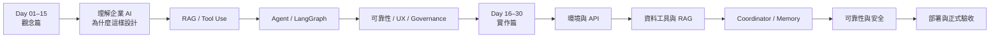

如果只是想做一個能聊天的 AI，現在其實已經不難。真正困難的是：**如何讓 AI 知道公司的資料在哪裡、什麼時候應該查工具、如何判斷資料是否足夠，以及怎麼把一個 Demo 變成可以穩定使用的產品。**

Data Machi 30 天學習系列，就是從這個問題出發。

這次我把整個系列重新整理成兩個階段：**Day 01–15 是觀念篇，Day 16–30 是實作篇。** 前半段先建立完整的企業 AI 架構思維，後半段不再只談概念，而是實際把這些設計放進 Data Machi，從開發環境、API、RAG、Coordinator，一路做到可靠性、安全與部署。

## 這 30 天會怎麼學？

<CardGroup cols={2}>
  <Card title="觀念篇｜Day 01–15" icon="brain" href="/30-days/day-01-enterprise-ai-is-not-chatbot">
    不急著寫程式，先理解企業 AI 真正要解決的問題。從知識工作、RAG、Tool Use，到 Agent、LangGraph、可靠性與治理，建立一張完整的架構地圖。
  </Card>

  <Card title="實作篇｜Day 16–30" icon="code" href="/data-machi-practice/index">
    把前半段的概念真正做出來。準備開發環境與 API，串接 Google Sheets、PDF RAG 與外部工具，再完成 Coordinator、記憶、可靠性、部署與驗收。
  </Card>
</CardGroup>

---

# Part 1｜觀念篇：先理解企業 AI 為什麼這樣設計

觀念篇不會從框架名稱開始背，而是從真實工作問題出發。每一篇都會先回答「企業到底遇到什麼問題」，再介紹對應的技術與架構。

## Day 01–05｜從聊天機器人走向企業知識工作流

| Day | 主題 | 這一天要解決的問題 |
| --- | --- | --- |
| **Day 01** | 企業 AI 不是聊天機器人 | 為什麼會回答問題，不代表能可靠完成工作？ |
| **Day 02** | 知識工作的 FUDAT 框架 | 一個真實工作任務，其實包含哪些步驟？ |
| **Day 03** | AI 的企業知識邊界 | 為什麼通用模型不知道公司內部最新資料？ |
| **Day 04** | Prompt vs Workflow | 為什麼把規則全部塞進 Prompt，最後一定會失控？ |
| **Day 05** | Data Machi 的演進 | 一個分析工具如何一步步變成企業知識工作流？ |

這五天先建立最重要的底層觀念：**企業真正需要的不是一個更會回答問題的模型，而是一套能找資料、做判斷、執行工具、保留狀態並處理失敗的系統。**

## Day 06–10｜RAG：讓 AI 找得到企業知識

| Day | 主題 | 這一天要解決的問題 |
| --- | --- | --- |
| **Day 06** | RAG 是什麼 | 如何讓 AI 從閉卷回答，變成先查資料再回答？ |
| **Day 07** | PDF 如何變成知識庫 | Parse、Chunk、Embedding、Index 各自在做什麼？ |
| **Day 08** | 關鍵字 vs 語意搜尋 | 什麼問題適合 Keyword Search，什麼問題適合 Semantic Search？ |
| **Day 09** | 掃描 PDF 與視覺內容 | 當文件不是乾淨文字，而是圖片、圖表與掃描頁時怎麼辦？ |
| **Day 10** | RAG 的能力邊界 | 找到文件之後，為什麼仍然不等於完成工作？ |

這一段的目的不是把所有資料都丟進向量資料庫，而是理解：**不同資料應該用最適合它的方式取得。** 文件適合 RAG，精確數字適合資料工具，即時狀態則應該直接查 API。

## Day 11–15｜Tool、Agent 與可控工作流

| Day | 主題 | 這一天要解決的問題 |
| --- | --- | --- |
| **Day 11** | RAG vs Tool Use | 「查知識」和「呼叫系統取得資料」到底差在哪裡？ |
| **Day 12** | LangChain 與 AI 元件整合 | 框架可以幫我們處理什麼，又有哪些事情不能交給框架？ |
| **Day 13** | 結構化資料工具 | 為什麼數字應由程式計算，而不是讓 LLM 自己算？ |
| **Day 14** | 跨系統知識地圖 | Confluence、Trello、Sheets、PDF 應該如何分工？ |
| **Day 15** | Coordinator 與 Agent 工作流 | 當一個問題同時需要查多個來源，系統如何拆解、查詢與整合？ |

Day 15 之後，觀念篇會把原本較後面的 Agent、ReAct、Memory、LangGraph、Human-in-the-loop、Retry/Fallback、Agent UX 與安全治理整理成**進階延伸觀念**，放在相關章節中串接閱讀，而不再為了篇數把同一條架構拆成很多彼此獨立的文章。

<Note>
  這次重新編排的原則，是讓一篇文章回答一個完整問題。像 Agent、Coordinator、Memory 與 Verification 本來彼此高度相關，重新整理後會以主題脈絡串在一起，而不是讓讀者每隔一天重新建立一次背景。
</Note>

---

# Part 2｜實作篇：把 Data Machi 一步步做出來

到了 Day 16，我們不再只討論「應該怎麼設計」，而是開始實際建立系統。這裡採用 Vibe Coding 的方式，你不需要先成為全端工程師，但要逐步理解自己正在修改哪個服務、憑證放在哪裡，以及每完成一步要如何驗證。

## Day 16–20｜把開發環境與外部服務準備好

| Day | 實作主題 | 完成結果 |
| --- | --- | --- |
| **Day 16** | Data Machi 服務地圖與 Vibe Coding | 看懂 GitHub、Vercel、Render、AI Coding Agent 與後端服務的關係 |
| **Day 17** | GitHub、Secret 與環境變數 | 建立正確版本來源，理解 `.env`、Render 與 Vercel 的 Secret 放置方式 |
| **Day 18** | Gemini API | 取得模型 API Key，完成最基本的模型連線測試 |
| **Day 19** | Google Service Account | 建立可由後端安全讀取 Google Sheets 的機器帳號 |
| **Day 20** | Atlassian 與 Groq API | 準備 Confluence、Trello 與語音轉文字的選配資料來源 |

## Day 21–25｜從最小產品走到真正的知識工作流

| Day | 實作主題 | 完成結果 |
| --- | --- | --- |
| **Day 21** | 建立專案副本與本機啟動 | 啟動 React 前端與 FastAPI 後端，確認專案骨架正常 |
| **Day 22** | 最小 AI 對話 | 完成 Frontend → Backend → Gemini 的第一條完整路徑 |
| **Day 23** | Google Sheets Tool | 讓 AI 能讀取、篩選與計算結構化資料 |
| **Day 24** | PDF RAG | 建立文件索引，讓回答可以引用真正的文件來源 |
| **Day 25** | Coordinator | 讓系統依問題選擇 Sheets、RAG 或其他工具，而不是由使用者自己決定 |

## Day 26–30｜把 Demo 變成可以交付的產品

| Day | 實作主題 | 完成結果 |
| --- | --- | --- |
| **Day 26** | Memory、Clarification 與 Verification | 支援多輪追問，並在資訊不足時知道何時應該重新查詢或向使用者釐清 |
| **Day 27** | Reliability 與 Security | 加入 Timeout、Fallback、錯誤處理、最小權限與 Secret 管理 |
| **Day 28** | Render 後端部署 | 將 FastAPI 與 Coordinator 部署成正式後端服務 |
| **Day 29** | Vercel 前端、CORS 與正式串接 | 完成前後端正式環境連線與跨網域設定 |
| **Day 30** | 驗收、交接與持續維護 | 完成端到端測試、權限盤點、版本回復與後續維護流程 |

---

## 每一篇文章會維持同一個閱讀節奏

為了避免文章變成「很多重點，但讀完不知道主線在哪裡」，重新編排後每一篇會盡量維持以下結構：

<Steps>
  <Step title="先從問題開始">
    先說明真實工作情境與目前做法的限制，不會一開始就丟框架名稱。
  </Step>
  <Step title="拆解核心觀念">
    說清楚這個技術到底解決什麼問題，以及它和前一個概念有什麼不同。
  </Step>
  <Step title="回到 Data Machi">
    用實際架構說明這個概念在系統中的位置，而不是只停留在理論。
  </Step>
  <Step title="補上踩坑與設計取捨">
    保留開發過程真的遇到的問題，說明哪些做法看似方便，但實際上容易出錯。
  </Step>
  <Step title="留下今天的一個結論">
    每篇最後只保留一個最重要的觀念，再自然銜接下一篇。
  </Step>
</Steps>

這也是整個系列希望維持的寫法：不把文章寫成規格書，也不把每一句話拆成獨立段落，而是用**情境 → 問題 → 原理 → Data Machi 實例 → 踩坑 → 結論**的方式，把一個主題完整說完。

<Info>
  如果你是第一次接觸企業 AI，建議從 Day 01 開始依序閱讀。如果你已經理解 RAG、Tool Use 與 Agent，也可以直接從 Day 16 進入實作篇，照著每一天的完成條件逐步建立自己的 Data Machi。
</Info>